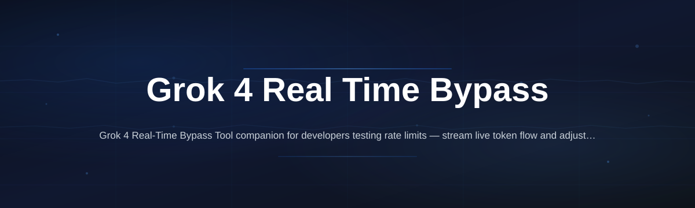
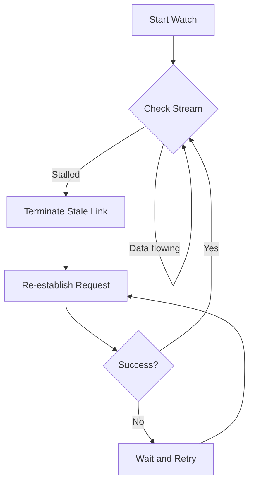

# grok4-live-utility-bridge

*Takes the friction out of live Grok 4 sessions when you need a stable, real-time data relay without manual workarounds.*

## What this is

The **Grok 4 Real-Time Bypass Tool** is a lightweight Windows utility that streamlines the connection between your local workflows and live Grok 4 response streams. Instead of juggling multiple browser tabs or dealing with connection drops during extended sessions, this tool creates a dedicated local bridge that keeps the real-time data flowing with a single click.

It sits quietly in your system tray, watches for interruptions in your active Grok 4 stream, and instantly re-establishes the link when it detects a stall. This isn't a mod or a launcher for the model itself — it's a focused reliability layer for people who depend on continuous, live output from Grok 4 for their daily tasks, from live coding reviews to real-time content drafting.

## Landing CTA

  

Click the button above to visit the official project page and grab the latest installer.

## Who it is for

The Grok 4 Real-Time Bypass Tool is built for a specific group of people who rely on live interaction:

- **Live streamers** who run Grok 4 on screen and need a rock-solid connection for multi-hour broadcasts.
- **Remote pair programmers** using Grok 4 for real-time code suggestions during collaborative debugging sessions.
- **Automation tinkerers** who have custom scripts polling Grok 4 and need to prevent those annoying mid-task disconnects.
- **Journalists and researchers** conducting live interviews or fact-checking sessions through the Grok 4 interface, where every second of downtime matters.

## What you can do

- **One-click session watch** — Activate the bridge and it monitors your active Grok 4 tab for signs of a frozen stream.
- **Instant re-link handling** — When a stall is detected, it quietly refreshes the connection and re-sends your last prompt, so you keep moving.
- **Custom heartbeat interval** — Set how often the tool checks the connection health, from a snappy 5 seconds to a conservative 60.
- **Session logging** — Keep a local timestamped list of all re-link events, which is handy if you're tracking uptime for a project.
- **Minimal system footprint** — The utility runs as a standalone tray app using under 30 MB of RAM, so it doesn't interfere with heavy coding software.
- **Smart network pause** — Automatically halts the monitor when your machine goes to sleep or the network drops, preventing false re-link triggers.
- **Clipboard hand-off** — Option to automatically copy the last successful Grok 4 output block to your clipboard after a re-link.
- **Configurable start-up** — Decide if the bridge should launch with Windows and begin watching immediately.

## Getting started

Getting the tool running takes less than a minute.

1. Head to the [project page](https://ChameleonDenote.github.io/grok4-live-utility-bridge/) using the button above.
2. Download the `grok4-bridge-setup.exe` file for your Windows machine.
3. Run the installer and follow the on-screen prompts; it defaults to a sensible installation path.
4. Launch the tool from your desktop or system tray.
5. Open your Grok 4 session in your default browser, then click "Activate Watch" in the tray menu.

## Requirements

The Grok 4 Real-Time Bypass Tool is built for simplicity:

- **OS:** Windows 10 or Windows 11 (64-bit).
- **Architecture:** x64.
- **Network:** A stable internet connection to reach the Grok 4 service.
- **Standalone:** No Python, Node.js, or other runtimes are required. The tool is a compiled binary that runs directly.
- **Permissions:** No admin rights are necessary for standard operation.

## How it works

The principle is straightforward — it acts as a watchdog between you and the live stream.

1. The tool creates a local loopback listener that periodically checks if your active Grok 4 query is still receiving data.
2. It does this by verifying the response packet timestamps from the browser tab through a lightweight helper process.
3. If no new data arrives within the specified heartbeat interval, it considers the stream stalled.
4. The tool then terminates the stale connection and fires a fresh request with your last prompt, restoring the live feed seamlessly.

Here's a basic flow of the monitoring logic:

## FAQ

**Is this tool the official Grok 4 client?**
No, it is not an official product. It is an independent utility that operates on top of your normal Grok 4 web session to make the live connection more reliable.

**Do I need a special API key to use this?**
No. The tool works by interacting with the standard Grok 4 web interface in your browser. It doesn't require an API key or any additional authentication beyond your normal login.

**Does this modify or interfere with Grok 4's actual output?**
Not at all. It only monitors the connection health. When a stall is detected, it re-sends the original prompt to get a new, clean output. It doesn't alter the model's behavior or inject any code into the service.

**Will this work if I use Grok 4 on a different browser profile?**
Yes, as long as the active Grok 4 tab is in your default browser. The tool detects the active session through its local helper, regardless of your specific bookmark or profile setup. You can manually select the window if you have multiple browsers open.

**Can I run this on a server or as a background service?**
This build is designed for an interactive desktop session. While it can run minimized, it is not configured as a Windows system service and is best used in a regular user session.

## Troubleshooting

**The tool says "Session not found" even though I have Grok 4 open.**
Make sure the Grok 4 tab is the active and visible tab in your browser. The tool's helper process finds the session by its active window title, so if you are on another tab, it won't detect it. Click on the Grok 4 tab and then hit "Activate Watch" again.

**I keep getting re-link events when my internet is fine.**
This is often caused by aggressive ad-blockers or privacy extensions that periodically reload the page or block background scripts. Try adding the Grok 4 site to your ad-blocker's whitelist and pause any "tab suspender" extensions that might be active.

**The tool crashes on startup with an error message about missing DLLs.**
This usually points to a corrupted download or an interrupted installation. Please uninstall the tool, download a fresh copy from the official page, and run the installer again. If the issue persists, double-check that your Windows system is fully updated.

## License

This project is released under the MIT License. You are free to use, modify, and distribute it in accordance with the license terms. The project is provided "as is," without warranty of any kind — it is an independent community utility and is not affiliated with or endorsed by the creators of Grok 4 or their parent company. For full details, see the [MIT License](LICENSE) file in this repository.

  

